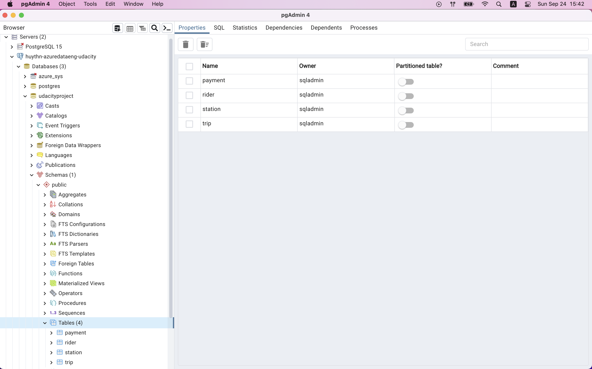

# Project: Building an Azure Data Warehouse for Bike Share Data Analytics

#### Repo structure

- **assets** : storing images used in README.MD, along with screenshots showing proof of task completion, including EXTRACT part.
- **SQL_ELT_scripts** : storing SQL scripts used for LOAD and TRANSFORM parts, in `Load` and `Transform` subfolders respectively.
- **StarSchemaPDF.pdf** : PDF file containing designed star schema.
- **aux_Files** : folder containing auxiliary file of `publicdate.csv`, which is not included in original dataset (in other word, I created it myself), and is necessary for LOAD part.

#### (Scroll down for solution at section II)

## I. Project Overview

### 1. Background

Divvy is a bike sharing program in Chicago, Illinois USA that allows riders to purchase a pass at a kiosk or use a mobile application to unlock a bike at stations around the city and use the bike for a specified amount of time. The bikes can be returned to the same station or to another station. The City of Chicago makes the anonymized bike trip data publicly available for projects like this where we can analyze the data.

Since the data from Divvy are anonymous, we have created fake rider and account profiles along with fake payment data to go along with the data from Divvy. The dataset looks like this:

The goal of this project is to develop a data warehouse solution using Azure Synapse Analytics. You will:

- Design a star schema based on the business outcomes listed below.
- Import the data into Synapse.
- Transform the data into the star schema.
- View the reports from Analytics.

### 2. Business outcomes

1. Analyze how much time is spent per ride:
    - Based on date and time factors such as day of week and time of day.
    - Based on which station is the starting and / or ending station.
    - Based on age of the rider at time of the ride.
    - Based on whether the rider is a member or a casual rider.
2. Analyze how much money is spent:
    - Per month, quarter, year.
    - Per member, based on the age of the rider at account start.
3. EXTRA CREDIT - Analyze how much money is spent per member:
    - Based on how many rides the rider averages per month.
    - Based on how many minutes the rider spends on a bike per month.

## II. Solutions

### Task 1. Create Azure resources

There are 3 resources required for this project:

- **Azure Database for PostgreSQL** : for storing the 4 raw data files in PostgreSQL before the ELT process, which have been nicely handled by Udacity via [GitHub starter repo](https://github.com/udacity/Azure-Data-Warehouse-Project/tree/main/starter).
- **Azure Storage Account** : for storing 4 data text files which are ingested from Azure Database for PostgreSQL via a one-time pipeline, basically the EXTRACT part of ELT process.
- **Azure Synapse Workspace** : for LOAD and TRANSFORM parts of the ELT process on those 4 data files, basically all the analytics jobs are here.

### Task 2. Design a star schema

The star schema to satisfy this project (made by [dbdiagram.io](https://dbdiagram.io/home)):

Here we have 2 fact tables and 2 dimension tables, which are:

- (Fact) Payment:
    + `payment_id` : surrogate primary key of the payment, int format.
    + `date` : date of the payment, date format of `yyyy-mm-dd`.
    + `amount` : payment amount, float format.
    + `rider_id` : secondary key, representing ID of rider, int format.

- (Fact) Trip:
    + `trip_id` : surrogate primary key of the trip, string format.
    + `trip_date` : date of the start of the trip, date format of `yyyy-mm-dd`.
    + `trip_time` : time of the start of the trip, time format of `hh:mm:ss`.
    + `started_at` : date and time of the start of the trip, datetime format of `yyyy-mm-dd hh:mm:ss`.
    + `ended_at` : date and time of the end of the trip, datetime format of `yyyy-mm-dd hh:mm:ss`.
    + `rider_id` : secondary key, representing ID of rider, int format.
    + `rideable_type` : type of the trip's transportation, string format.
    + `rider_age` : age of the rider, int format.
    + `start_station_id` : ID of station where the trip starts, string format.
    + `end_station_id` : ID of station where the trip ends, string format.
    + `duration` : total time length of the trip, in SECONDS, bigint format.

- (Dimension) Rider:
    + `rider_id` : surrogate promary key, representing ID of rider, int format.
    + `address` : rider's address, string format.
    + `first` : rider's first name, string format.
    + `last` : rider's last name, string format.
    + `birthday` : rider's birthday, datetime format of `yyyy-mm-dd`.
    + `account_start_date` : rider's account start date, datetime format of `yyyy-mm-dd`.
    + `account_end_date` : rider's account end date, maybe datetime format of `yyyy-mm-dd` or `NULL` which indicates the acocunt is still active.
    + `is_member` : status of this rider's account, either `TRUE` or `FALSE`.

- (Dimension) Station:
    + `station_id` : ID of the station, string format.
    + `name` : name of the station, string format.
    + `latitude` : latitude of the station, float format.
    + `longitude` : longitude of the station, float format.

- (Dimension) Date:
    + `date_id` : basically the date in `yyyy-mm-dd` format, from `2013-01-01` to `2022-12-31`.
    + `day` : calendar day, int format, `1~31`.
    + `month` : calendar month, int format, `1~12`.
    + `quarter` : yearly quarter, int format, `1~4` for Q1 to Q4.
    + `year` : calendar year, int format, `xxxx`.
    + `day_of_week` : weekday, int format, `1~7` for Sunday to Saturday.
    + `day_of_year` : yearly day, int format, `1~365` (sometimes `366`).

  
### Task 3. Create the data in PostgreSQL

As stated above, the rat data files are fetched onto Azure Database for PostgreSQL using Python script and raw data files provided by Udacity via [GitHub starter repo](https://github.com/udacity/Azure-Data-Warehouse-Project/tree/main/starter).

After successfully creating the data, we can use pgAdmin to check:

### Task 4. EXTRACT the data from PosgreSQL to Blob Storage

The steps follow:

1. Locate the Azure Synapse workspace.
2. Use the ingest wizard to create a one-time pipeline that ingests the data from PostgreSQL into Azure Blob Storage.
3. Verify that all four tables are represented as delimited text files in Blob Storage, ready for loading into the data warehouse.

For the Date dimension table, as we do not have original raw data, I decided to create one using Excel and pretty simple Excel functions. The schema follows Date dimension schema above, and the raw data file (CSV) is stored at `aux_Files/publicdate.csv`.

### Task 5. LOAD the data into external tables in the data warehouse

Now we have 5 delimited text files (CSV). In order to load them from Blob Storage into external staging tables in data warehouse:

1. Secure a connection from Azure Synapse Workspace to the Blob Storage. The script used for this is stored at `./SQL_ELT_scripts/Load/init_database_connection.sql`.
2. For each of the CSV, use an SQL script with `CREATE EXTERNAL TABLE` to generate external table in serverless SQL pool, with reference to the CSV file in Blob Storage. This external table will serve as staging table for later TRANSFORM stage.
3. Verify that all 5 external tables are created in serverless SQL pool.

You can see all the SQL scripts in `SQL_ELT_scripts/Load`.

### Task 6. TRANSFORM the data to the star schema using CETAS

Now we have 5 external staging tables, the final task is to transform them into star schema we designed:

1. Define for file format.
2. Define the data source to persist the results.
3. For each of the 5 tables:
    - Use CETAS to export select statement.
    - Query head rows to check the desired output.

You can see all the SQL scripts in `SQL_ELT_scripts/Transform`.

