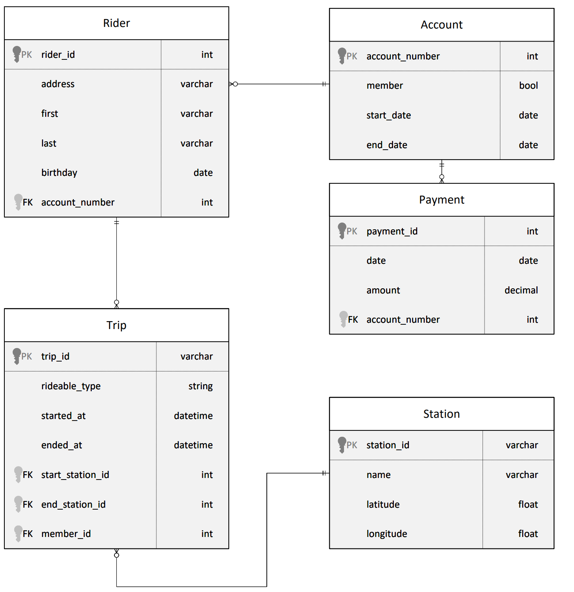
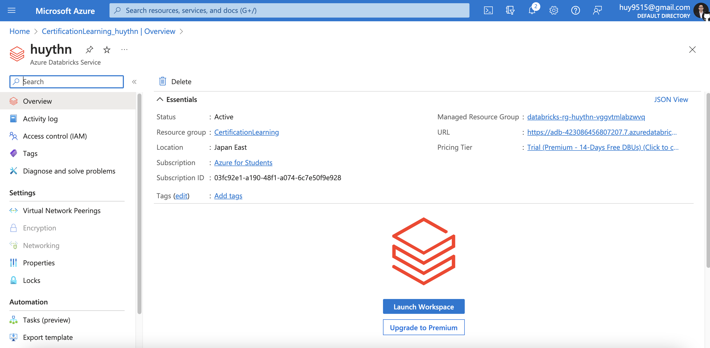
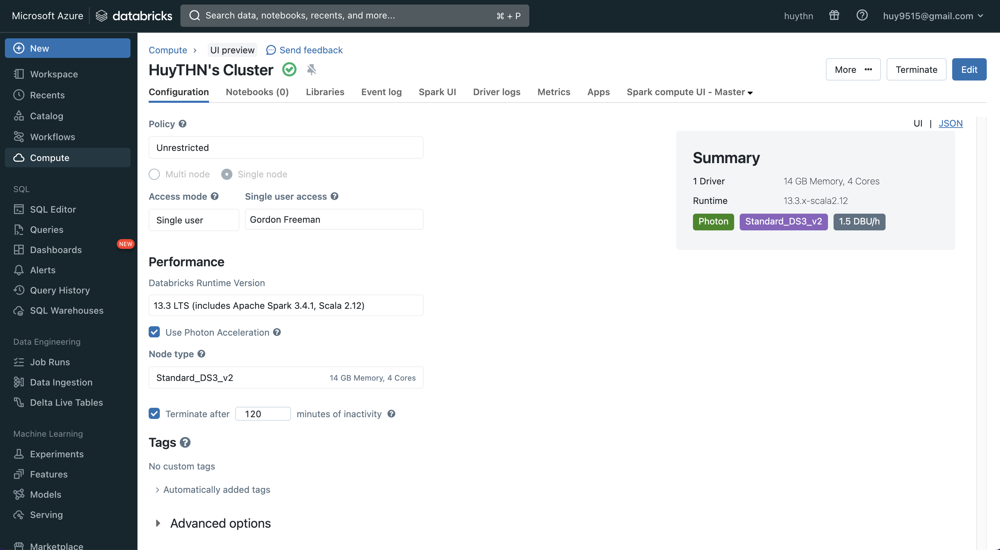
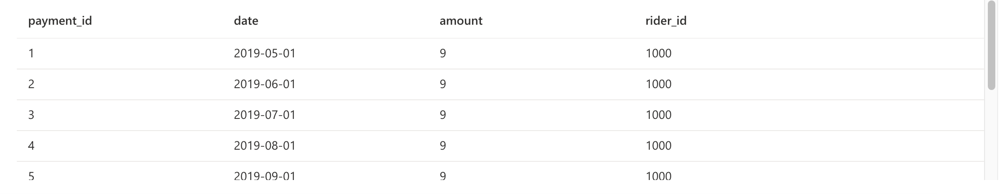
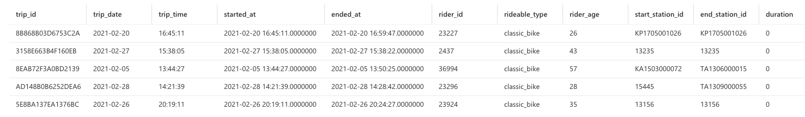
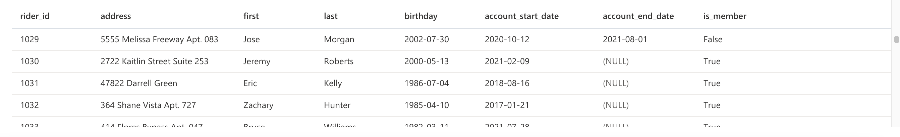
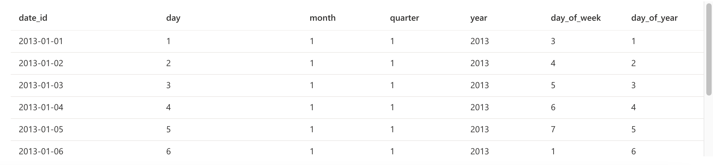
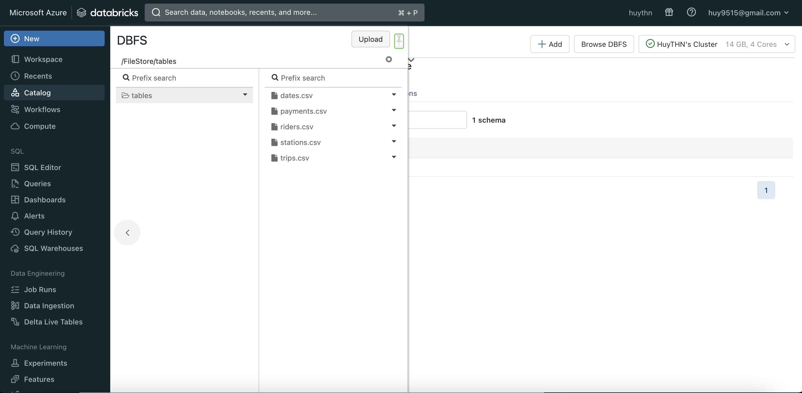
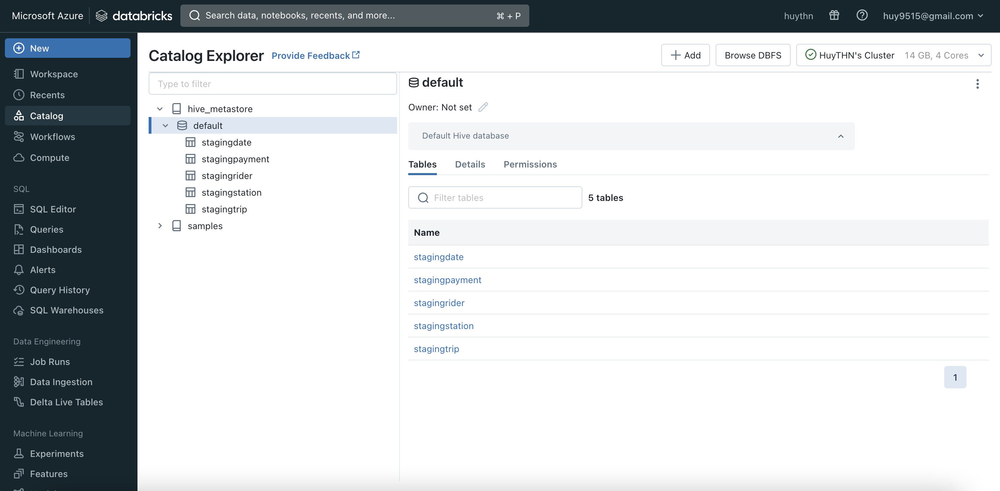
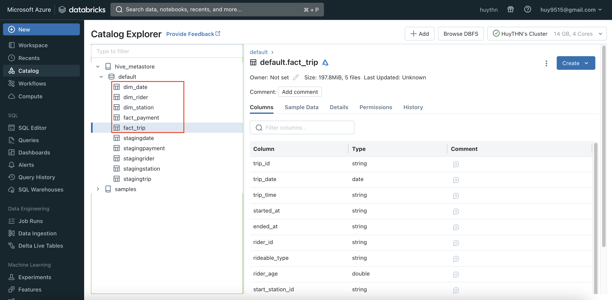

# Project: Building an Azure Data Lake for Bike Share Data Analytics

#### Repo structure

- **assets** : storing images used in README.MD, along with screenshots showing proof of task completion, including EXTRACT part.
- **notebooks** : storing Python notebooks used for EXTRACT, LOAD and TRANSFORM parts, with corresponding names.
- **StarSchemaPDF.pdf** : PDF file containing designed star schema.
- **aux_Files** : folder containing auxiliary file of `publicdate.csv`, which is not included in original dataset (in other word, I created it myself), and is necessary for LOAD part.

#### (Scroll down for solution at section II)

## I. Project Overview

### 1. Background

Divvy is a bike sharing program in Chicago, Illinois USA that allows riders to purchase a pass at a kiosk or use a mobile application to unlock a bike at stations around the city and use the bike for a specified amount of time. The bikes can be returned to the same station or to another station. The City of Chicago makes the anonymized bike trip data publicly available for projects like this where we can analyze the data.

Since the data from Divvy are anonymous, we have created fake rider and account profiles along with fake payment data to go along with the data from Divvy. The dataset looks like this:

The goal of this project is to develop a data lake solution using Azure Databricks using a lake house architecture. You will:

1. Design a star schema based on the business outcomes below.
2. Import the data into Azure Databricks using Delta Lake to create a Bronze data store.
3. Create a gold data store in Delta Lake tables.
4. Transform the data into the star schema for a Gold data store.

### 2. Business outcomes

1. Analyze how much time is spent per ride:
    - Based on date and time factors such as day of week and time of day.
    - Based on which station is the starting and / or ending station.
    - Based on age of the rider at time of the ride.
    - Based on whether the rider is a member or a casual rider.
2. Analyze how much money is spent:
    - Per month, quarter, year.
    - Per member, based on the age of the rider at account start.
3. EXTRA CREDIT - Analyze how much money is spent per member:
    - Based on how many rides the rider averages per month.
    - Based on how many minutes the rider spends on a bike per month.

## II. Solutions

### Azure resources

First, we create an Azure Databricks resource instance.

Next, we create a Cluster. In case you wonder who Gordon Freeman is, I'm regrettably telling you that you already missed a [legendary childhood gem](https://store.steampowered.com/app/70/HalfLife/) (alright I know that sounds cringe, gonna change the name later).

### Task 1. Design a star schema

The star schema to satisfy this project (made by [dbdiagram.io](https://dbdiagram.io/home)):

Here we have 2 fact tables and 2 dimension tables, which are:

- (Fact) Payment:
    + `payment_id` : surrogate primary key of the payment, int format.
    + `date` : date of the payment, date format of `yyyy-mm-dd`.
    + `amount` : payment amount, float format.
    + `rider_id` : secondary key, representing ID of rider, int format.

- (Fact) Trip:
    + `trip_id` : surrogate primary key of the trip, string format.
    + `trip_date` : date of the start of the trip, date format of `yyyy-mm-dd`.
    + `trip_time` : time of the start of the trip, time format of `hh:mm:ss`.
    + `started_at` : date and time of the start of the trip, datetime format of `yyyy-mm-dd hh:mm:ss`.
    + `ended_at` : date and time of the end of the trip, datetime format of `yyyy-mm-dd hh:mm:ss`.
    + `rider_id` : secondary key, representing ID of rider, int format.
    + `rideable_type` : type of the trip's transportation, string format.
    + `rider_age` : age of the rider, int format.
    + `start_station_id` : ID of station where the trip starts, string format.
    + `end_station_id` : ID of station where the trip ends, string format.
    + `duration` : total time length of the trip, in SECONDS, bigint format.

- (Dimension) Rider:
    + `rider_id` : surrogate promary key, representing ID of rider, int format.
    + `address` : rider's address, string format.
    + `first` : rider's first name, string format.
    + `last` : rider's last name, string format.
    + `birthday` : rider's birthday, datetime format of `yyyy-mm-dd`.
    + `account_start_date` : rider's account start date, datetime format of `yyyy-mm-dd`.
    + `account_end_date` : rider's account end date, maybe datetime format of `yyyy-mm-dd` or `NULL` which indicates the acocunt is still active.
    + `is_member` : status of this rider's account, either `TRUE` or `FALSE`.

- (Dimension) Station:
    + `station_id` : ID of the station, string format.
    + `name` : name of the station, string format.
    + `latitude` : latitude of the station, float format.
    + `longitude` : longitude of the station, float format.

- (Dimension) Date:
    + `date_id` : basically the date in `yyyy-mm-dd` format, from `2013-01-01` to `2022-12-31`.
    + `day` : calendar day, int format, `1~31`.
    + `month` : calendar month, int format, `1~12`.
    + `quarter` : yearly quarter, int format, `1~4` for Q1 to Q4.
    + `year` : calendar year, int format, `xxxx`.
    + `day_of_week` : weekday, int format, `1~7` for Sunday to Saturday.
    + `day_of_year` : yearly day, int format, `1~365` (sometimes `366`).

  
### Task 2. Import data to Azure Databricks using Delta Lake to create a Bronze data store

First, we need to upload raw data tables to Azure Databricks Cluster. We already have raw data files provided by Udacity dataset featuring 4 raw data tables, similar to [previous project](https://github.com/TranHuuNhatHuy/UdacityDataEngAzure/tree/main/II.CloudDataWarehouses).

For the Date dimension table, as we do not have original raw data, I decided to create one using Excel and pretty simple Excel functions. The schema follows Date dimension schema above, and the raw data file (CSV) is stored at `aux_Files/dates.csv`.

Now we just upload all 5 CSV files to DFBS target directory of `/FileStore/tables/`.

This is our Bronze data store - a.k.a storing those raw data files - in Databricks.

### Task 3. Create a Gold data store in Delta Lake tables

The steps follow:

1. EXTRACT data from those raw CSV files in Bronze data store by Spark code in Python notebooks, and write them to Delta file system. The Python notebook used for this process is stored in `notebooks/EXTRACT.ipynb`.
2. LOAD data from Delta files to create staging tables, using Spark code in Python notebooks. The Python notebook used for this process is stored in `notebooks/LOAD.ipynb`.
3. Verify that all 5 staging tables are represented in the Delta Lake.

### Task 4. Transform the data into the star schema for a Gold data store

This task is basically the TRANSFORM stage in ELT process. For each of 5 tables, steps follow:

1. Fetch data from corresponding staging table.
2. Data wrangling.
3. Save as fact/dim Gold tables.

The Python notebook used for this process is stored in `notebooks/TRANSFORM.ipynb`.

