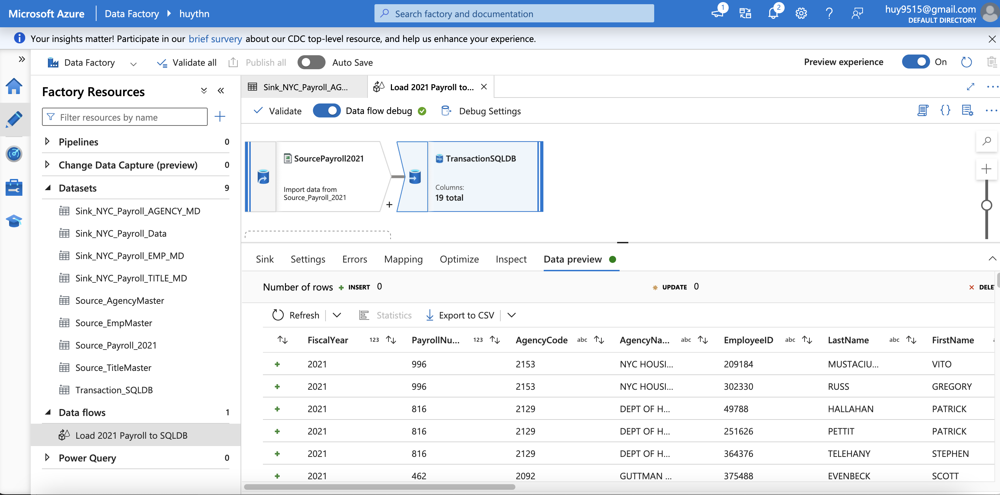

# Project: Data Integration Pipelines for NYC Payroll Data Analytics

#### Repo structure

- **ADF_JSONs** : storing all JSON files related to project configurations in ADF.
- **SQL_scripts/Synapse** : storing Synapse scripts used for ELT process.
- **assets** : storing images used in README.MD, along with screenshots showing proof of task completions.
- **data** : project data files provided by Udacity.

#### (Scroll down for solution at section II)

## I. Project Overview

### 1. Background

The City of New York would like to develop a Data Analytics platform on Azure Synapse Analytics to accomplish two primary objectives:

Analyze how the City's financial resources are allocated and how much of the City's budget is being devoted to overtime.
Make the data available to the interested public to show how the City’s budget is being spent on salary and overtime pay for all municipal employees.
You have been hired as a Data Engineer to create high-quality data pipelines that are dynamic, can be automated, and monitored for efficient operation. The project team also includes the city’s quality assurance experts who will test the pipelines to find any errors and improve overall data quality.

The source data resides in Azure Data Lake and needs to be processed in a NYC data warehouse in Azure Synapse Analytics. The source datasets consist of CSV files with Employee master data and monthly payroll data entered by various City agencies.


The goal of this project is to develop a data lake solution using Azure Databricks using a lake house architecture. You will:

1. Design a star schema based on the business outcomes below.
2. Import the data into Azure Databricks using Delta Lake to create a Bronze data store.
3. Create a gold data store in Delta Lake tables.
4. Transform the data into the star schema for a Gold data store.

### 2. Business outcomes

1. Analyze how much time is spent per ride:
    - Based on date and time factors such as day of week and time of day.
    - Based on which station is the starting and / or ending station.
    - Based on age of the rider at time of the ride.
    - Based on whether the rider is a member or a casual rider.
2. Analyze how much money is spent:
    - Per month, quarter, year.
    - Per member, based on the age of the rider at account start.
3. EXTRA CREDIT - Analyze how much money is spent per member:
    - Based on how many rides the rider averages per month.
    - Based on how many minutes the rider spends on a bike per month.


## II. Solutions

### Required resources

For this project, you'll do your work in the Azure Portal, using several Azure resources including:

- Azure Data Lake Gen2
- Azure SQL DB
- Azure Data Factory
- Azure Synapse Analytics

You'll also need to create a Github repository for this project. At the end of the project, you will connect your Azure pipelines to Github and submit the URL or contents of the repository.

### Step 1. Prepare the Data Infrastructure

#### 1. Create data lake and upload data

Create an Azure Data Lake Storage Gen2 (storage account) and associated storage container resource named `adlsnycpayroll-{yourfirstname}-lastintial`. Create three directories in this storage container named:

- `dirpayrollfiles`
- `dirhistoryfiles`
- `dirstaging`

Upload these files from the project data to the `dirpayrollfiles` folder:

- `EmpMaster.csv`
- `AgencyMaster.csv`
- `TitleMaster.csv`
- `nycpayroll_2021.csv`

Upload this file (historical data) from the project data to the `dirhistoryfiles` folder:

- `nycpayroll_2020.csv`


#### 2. Azure Data Factory Resource


#### 3. Initiate SQL DB to store current year of payroll data


#### 4. Create Synapse Analytics workspace

1. Create a Synapse Analytics workspace.
2. Create a SQL dedicated pool in the Synapse Analytics workspace. Select DW100c as performance level. Keep defaults for other settings.
3. Define file format and data source for master data tables and payroll transaction tables.
4. Create Employee Master data.
5. Create Job Title table.
6. Create Agency Master table.
7. Create Payroll transactional data table.

Associated SQL scripts are stored in `SQL_scripts/Synapse`.


  
### Step 2. Create Linked Services

1. Create a Linked Service for Azure Data Lake

In Azure Data Factory, create a linked service to the data lake that contains the data files:

- From the data stores, select Azure Data Lake Gen 2.
- Test the connection.

2. Create a Linked Service to SQL Database that has the current (2021) data

3. Create a Linked Service to the SQL pool, for Synapse Analytics.


### Step 3. Create Datasets in Azure Data Factory

1. Create the datasets for the 2021 Payroll file on Azure Data Lake Gen2

- Select DelimitedText
- Set the path to the `nycpayroll_2021.csv` in the Data Lake
- Preview the data to make sure it is correctly parsed

2. Repeat the same process to create datasets for the rest of the data files in the Data Lake

- `EmpMaster.csv`
- `TitleMaster.csv`
- `AgencyMaster.csv`
- Remember to publish all the datasets

3. Create the dataset for transaction data table that should contain current (2021) data in SQL DB

4. Create the datasets for destination (target) tables in Synapse Analytics:

- For `NYC_Payroll_EMP_MD`
- For `NYC_Payroll_TITLE_MD`
- For `NYC_Payroll_AGENCY_MD`
- For `NYC_Payroll_Data`


### Step 4. Create Data Flows and Pipelines

1. **In Azure Data Factory, create the data flow to load 2021 Payroll Data to SQL DB transaction table (in the future NYC will load all the transaction data into this table)**

    - Create a new data flow
    - Select the dataset for the 2021 payroll file as the source
    - Select the sink dataset as the payroll table on SQL DB
    - Make sure to reassign any missing source to target mappings

    

2. **Create Pipeline to load 2021 Payroll data into transaction table in the SQL DB**

    - Create a new pipeline
    - Select the data flow to load the 2021 file into SQLDB
    - Trigger the pipeline
    - Monitor the pipeline
    - Take a screenshot of the Azure Data Factory screen pipeline run after it has finished

    

    - Make sure the data is successfully loaded into the SQL DB table

    

3. **Create data flows to load the data from the data lake files into the Synapse Analytics data tables**

    - Create the data flows for loading Employee, Title, and Agency files into corresponding SQL pool tables on Synapse Analytics
    - For each Employee, Title, and Agency file data flow, sink the data into each target Synaspe table

    

    

    

4. **Create a data flow to load 2021 data from SQL DB to Synapse Analytics**

    

5. **Create pipelines for Employee, Title, Agency, and year 2021 Payroll transaction data to Synapse Analytics containing the data flows**

    - Select the dirstaging folder in the data lake storage for staging
    - Optionally you can also create one master pipeline to invoke all the Data Flows
    - Validate and publish the pipelines

    

    

6. **Trigger and monitor the Pipelines**

    - Take a screenshot of each pipeline run after it has finished, or one after your master pipeline run has finished.
    - In this project, I ran 5 smaller pipelines instead of the master pipeline.

    

### Step 5. Data Aggregation & Parameterization

In this step, you'll extract the 2021 year data and historical data, merge, aggregate and store it in Synapse Analytics. The aggregation will be on `Agency Name`, `Fiscal Year` and `TotalPaid`.

1. Create a Summary table in Synapse with the following SQL script and create a dataset named `table_synapse_nycpayroll_summary`

```sql
CREATE TABLE [dbo].[NYC_Payroll_Summary] ( 
    [FiscalYear] [int] NULL, 
    [AgencyName] [varchar](50) NULL, 
    [TotalPaid] [float] NULL 
)
```


2. Create a new dataset for the Azure Data Lake Gen2 folder that contains the historical files.

- Select `dirhistoryfiles` in the data lake as the source.


3. Create new data flow and name it Dataflow Aggregate Data

- Create a data flow level parameter for `Fiscal Year`, for example, `dataflow_param_FiscalYear`.
- Add first Source for `table_sqldb_nyc_payroll_data` table
- Add second Source for the Azure Data Lake history folder

4. Create a new Union activity in the data flow and Union with history files

5. Add a Filter activity after Union

- In Expression Builder, enter `toInteger(FiscalYear) >= $dataflow_param_FiscalYear`

6. Derive a new `TotalPaid` column

- In Expression Builder, enter `RegularGrossPaid + TotalOTPaid+TotalOtherPay`

7. Add an Aggregate activity to the data flow next to the `TotalPaid` activity

- Under Group By, Select `AgencyName` and `Fiscal Year`

8. Add a Sink activity to the Data Flow

- Select the dataset to target (sink) the data into the Synapse Analytics Payroll Summary table.
- In Settings, select Truncate Table.


9. Create a new Pipeline and add the Aggregate data flow

- Create a new Global Parameter (This will be the Parameter at the global pipeline level that will be passed on to the data flow). Here I add `globalParamFiscalYear` with value of 2020.
- In Parameters, select Pipeline Expression
- Choose the parameter created at the Pipeline level. The expression shall become `@pipeline().globalParameters.globalParamFiscalYear`.


10. Validate, Publish and Trigger the pipeline. Enter the desired value for the parameter.

11. Monitor the Pipeline run and take a screenshot of the finished pipeline run.


### Step 6. Connect your Project to GitHub

In this step, you'll connect Azure Data Factory to Github

- Login to your Github account and create a new Repo in Github.
- Connect Azure Data Factory to Github.
- Select your Github repository in Azure Data Factory.
- Publish all objects to the repository in Azure Data Factory.
- Download your project repository from Github and submit your repository and screenshots of your pipeline runs. **A little note** : for this step, I chose the same GitHub project submission repo. You will see all the ADF JSON stuffs in my submission repo.


